<a  href="https://www.twilio.com">

</a>

# Per Agent Voicemail Service and UI

Provides a solution for tasks to be routed to agents using a 4 digit extension, and for that agent to be able to have voicemails left for them when unavailable.

## Features

### Supervisor can assign extensions in the Teams view

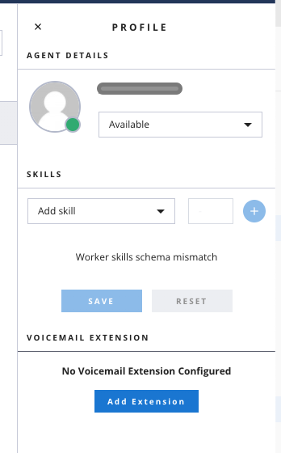

### Users can dial an extension to be directed to the agent

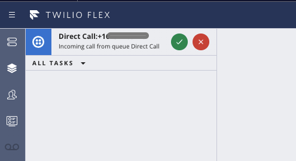

### Agents have a voicemail box which will store voicemails for calls they were unable to take

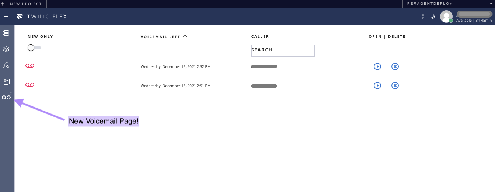

### Agents can create a task to listen to their voicemails

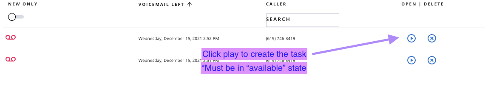
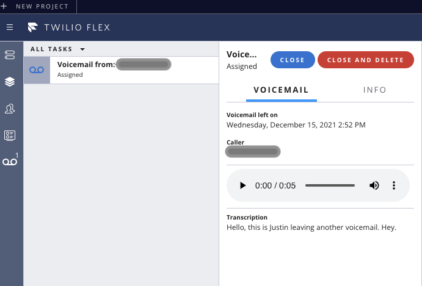

### Agents can callback customers from voicemail button
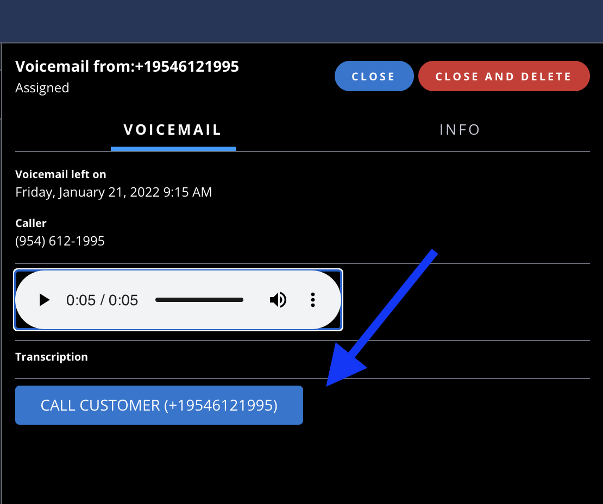

### Requirements

To deploy this plugin, you will need:

- An active Twilio account with Flex provisioned. Refer to the [Flex Quickstart](https://www.twilio.com/docs/flex/quickstart/flex-basics#sign-up-for-or-sign-in-to-twilio-and-create-a-new-flex-project") to create one.
- npm version 5.0.0 or later installed (type `npm -v` in your terminal to check)
- Node.js version 12 or later installed (type `node -v` in your terminal to check)
- [Twilio CLI](https://www.twilio.com/docs/twilio-cli/quickstart#install-twilio-cli) along with the [Flex CLI Plugin](https://www.twilio.com/docs/twilio-cli/plugins#available-plugins) and the [Serverless Plugin](https://www.twilio.com/docs/twilio-cli/plugins#available-plugins). Run the following commands to install them:

  ```bash
  # Install the Twilio CLI
  npm install twilio-cli -g
  # Install the Serverless and Flex as Plugins
  twilio plugins:install @twilio-labs/plugin-serverless
  twilio plugins:install @twilio-labs/plugin-flex
  ```

## Set-Up Overview

1) Taskrouter dependencies
2) Deploy serverless environment
3) Deploy studio IVR
4) Deploy flex plugin
5) Configure Taskrouter event webhook

### 1)Taskrouter set-up will be done in the Twilio console. [Click here](https://console.twilio.com/us1/develop/taskrouter/workspaces?frameUrl=%2Fconsole%2Ftaskrouter%2Fworkspaces) then select your workspace

- Create "Direct Call" Task Queue (Leave all default values except the name)

- Create "Voicemail" Task Queue (Change queue expression to 1==2)

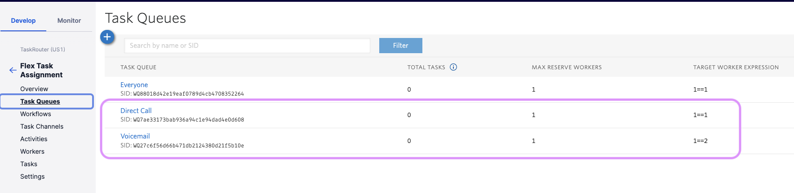

- Create "Direct Call" Task Channel, all default except for name

- Create "Voicemail", all default except for name

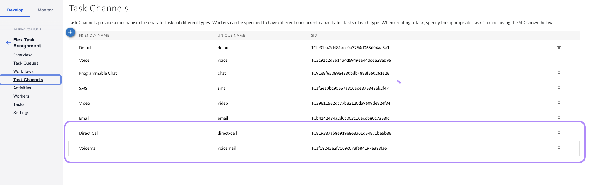

- Create the "Direct Call" workflow:
  - Navigate to the workflow section in TaskRouter section of console
  - Click + to add a new workflow
  - Workflow name set to `Direct Call`
  - Add a filter `Direct Call to agent`
    - Click create a new filter
    - Click unamed filter to rename to `Direct Call to agent`
    - Matching Tasks = `type == 'directCall'`
    - Task Queue = `Direct Call`
    - Skip timeout = `workers.available == 0`
    - Timeout = `1`
    - Expression = `worker.workerExtension == task.workerExtension`
    - Within the direct call to agent click `Add a Step`
    - In the second step, Task Queue = `Voicemail`, All other setting can stay default
  - Add a filter `Voicemail Listen`
    - Click create a new filter
    - Click unamed filter to rename it to `Voicemail Listen`
    - Matching Tasks = `type == 'voicemailListen'`
    - Task Queue = `Direct Call`
    - Known Worker, Select the radio button `Worker SID`, then enter the following expression `task.workerSID`
  - At the bottom of workflow, select Default Task Queue `Everyone`

We will also include two references for the workflow configuration:

- Screenshot of the configuration in console:

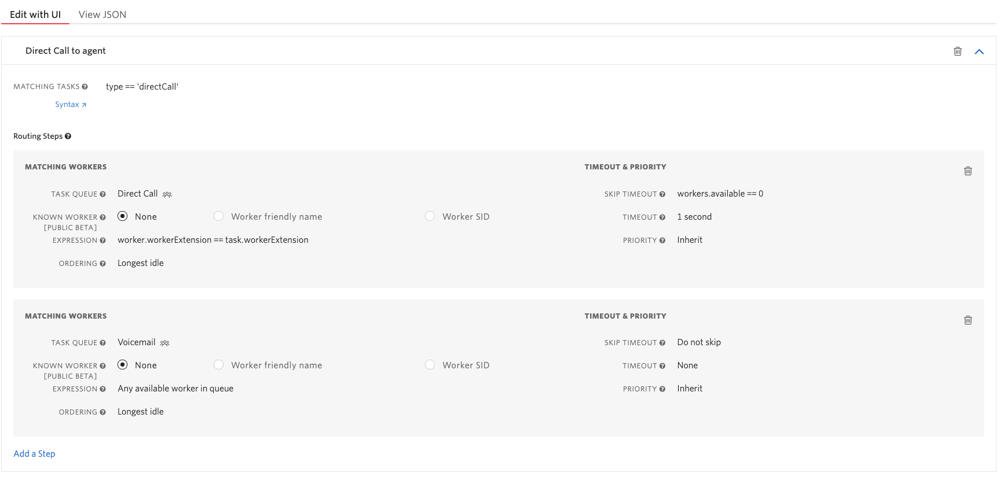
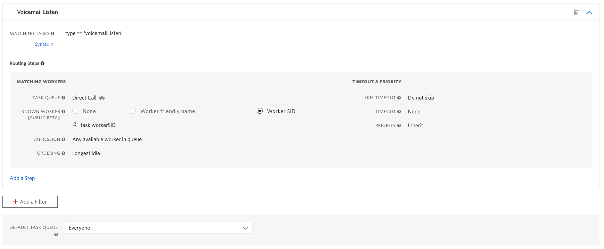

- Json of workflow below, also located at ./Agent-Voicemail-Service/public/DirectCallWorkflow.json

Note: Below friendly names are used for easy reference, but in the actual JSON these values will be SIDs

```json
{
  "task_routing": {
    "filters": [
      {
        "filter_friendly_name": "Direct Call to agent",
        "expression": "type == 'directCall'",
        "targets": [
          {
            "queue": "Direct Call",
            "expression": "worker.workerExtension == task.workerExtension",
            "timeout": 1,
            "skip_if": "workers.available == 0"
          },
          {
            "queue": "Voicemail"
          }
        ]
      },
      {
        "filter_friendly_name": "Voicemail Listen",
        "expression": "type == 'voicemailListen'",
        "targets": [
          {
            "queue": "Direct Call",
            "known_worker_sid": "task.workerSID"
          }
        ]
      }
    ],
    "default_filter": {
      "queue": "Everyone"
    }
  }
}
```

### 2)Deploying Serverless environment

- Clone repo to your local environment

```bash
git clone https://code.hq.twilio.com/twilio/plugin-per-agent-voicemail.git
```

- Modify Environmental variables
  - Rename /Agent-Voicemail-Service/template.env to .env
  - Edit /Agent-Voicemail-Service/.env and update the following variables
    - SYNC_SERVICE_SID - (this is you default sync service and can be found by [clicking here](https://console.twilio.com/us1/develop/sync/services?frameUrl=/console/sync/services))
    - TWILIO_WORKSPACE_SID - (Your Taskrouter workspace SID can be found by [clicking here](https://console.twilio.com/us1/develop/taskrouter/workspaces?frameUrl=%2Fconsole%2Ftaskrouter%2Fworkspaces%3Fx-target-region%3Dus1))
    - DIRECTCALL_WORKFLOW_SID - (Your Direct call workflow sid, can be found in workflows page of TaskRouter console)

- Deploy Serverless environment
  - Using Twilio CLI, first confirm you are connected via the correct profile linked you your Flex account SID

      ```bash
      twilio profiles:list
      twilio profiles:use {profileName}
      ```

  - Run deployment script from /Agent-Voicemail-Service directory

      ```bash
      twilio serverless:deploy
      ```

  - Navigate to functions page and document your serverless domain for the service `Agent-Voicemail-Service`, we will use this later for our plugin deployment. [Click Here](https://console.twilio.com/us1/develop/functions/services?frameUrl=%2Fconsole%2Ffunctions%2Foverview%2Fservices%3Fx-target-region%3Dus1)
  ex: `agent-voicemail-service-8355-dev.twil.io`

### 3)Deploying Studio IVR

- Create the Direct Call Voice IVR
  - Navigate to the Studio dashboard in console: <https://console.twilio.com/develop/studio/overview>
  - Click the `+` to create a new studio flow
  - Name the studio flow `Direct Call Voice IVR`
  - Click Next, then select the `Start from scratch` option.
- Copy template Studio flow to `Direct call Voice IVR`
  - Navigate to the studio canvas for the new flow
  - Click on the Trigger, in flow configuration click on `Show Flow JSON`
  - Completely replace this JSON with the example file located at /Agent-Voicemail-Service/public/VoiceIVR.json and then click save.

  At this point, your studio should have reloaded and you will see the canvas filled with the widgets from the template.

- Update studio flow with correct environmental variables
  - Click on the `checkExtension` widget. In the `Request URL` replace {yourserverlessdomain} with your serverlesss domain from when we deployed our function service
    Example entry for `Request URL` = `https://agent-voicemail-service-8355-dev.twil.io/checkExtension`
  - Click on the `SendToEveryone` Widget. Set the following values:
    - WORKFLOW = `Assign to Anyone`
    - CHANNEL = `Voice`
    - Click save
  - Click on the `SendCallToAgent` Widget. Set the following values:
    - WORKFLOW = `Direct Call`
    - CHANNEL = `Direct Call`
    - Click save
- To complete the studio flow set-up, click on the red `Publish` button on the top.
- Final step is to configure your number so that it uses our new studio flow. Navigate to the configuration page for your inbound Flex number and for the `A CALL COMES IN` parameter, select `Direct Call Voice IVR`

### 4)Deploying the Flex plugin

- Configure environmental variables
  - Rename `/plugin-per-agent-voicemail/plugin-per-agent-voicemail/template.env` to `.env`
  - Edit .env and add your serverless domain from function service deployment (include `https://`)
        Example:'https://agent-voicemail-service-1334-dev.twil.io'
  - Rename `/plugin-per-agent-voicemail/plugin-per-agent-voicemail/appConfig Template.js` to `appConfig.js`
  - Run npm install:

    ```bash
    npm install
    ```

- Deploy the plugin
  a) From the directory `/plugin-per-agent-voicemail/plugin-per-agent-voicemail/` execute the below command:
  
  ```bash
  twilio flex:plugins:deploy --major --changelog "initial deployment of per agent voicemail" --description "First deployment of agent voicemail plugin"
  ```

  b) After the above command finishes, the output will provide another command to push the release to production. Below is an example, but you should copy and paste from your CLI.

  ```bash
  twilio flex:plugins:release --plugin plugin-per-agent-voicemail@1.0.0 --name "Autogenerated Release 1639529340181" --description "The description of this Flex Plugin Configuration."
  ```

### 5)One final step  

- We need to go back to Taskrouter config now to send our task events to our function listener. NAvigate to your TaskRouter workspace in the console, and select the Settings from the left nav.

At the bottom of the page under the `Event Callbacks` header, we will add the uri to our event handler which is our serverless domain and the function /eventStream.

For the `EVENT CALLBACK URL` enter `https://{yourserverlessdomain}/eventStream`

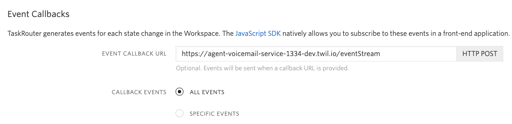

Ok, all done! you should be able to add an extension to your worker and make some voicemails!

## Changelog

V 1.0 Initial Release

## Disclaimer

This software is to be considered "sample code", a Type B Deliverable, and is delivered "as-is" to the user. Twilio bears no responsibility to support the use or implementation of this software.
